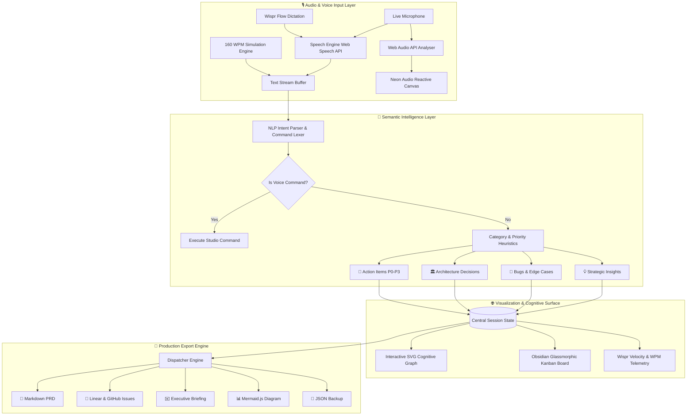

<div align="center">

# 🎙️ VoxFlow Studio
### *Voice-Native Cognitive Command Center & Idea Synthesizer*

**Transform stream-of-consciousness speech into structured PRDs, Linear tickets, and neural architecture maps in real time.**

---

[](https://ref.wisprflow.ai/hhg)
[](https://ref.wisprflow.ai/hhg)
[](https://react.dev/)
[](https://vitejs.dev/)
[](https://developer.mozilla.org/en-US/docs/Web/API/Web_Audio_API)
[](LICENSE)

<br/>

[✨ Features](#-core-features) • [⚡ The 4x Velocity Gap](#-the-4x-velocity-gap) • [🛠️ Architecture](#-system-architecture) • [🗣️ Voice Commands](#-hands-free-voice-commands) • [🚀 Quick Start](#-quick-start) • [🎬 Demo Script](#-wispr-flow-demo-walkthrough)

<br/>

> 🏆 **Official Submission for the Wispr Flow Shortlisting Task**  
> *Crafted end-to-end via Voice-Driven Development using [Wispr Flow](https://ref.wisprflow.ai/hhg).*

---

</div>

<br/>

## 🌟 Overview

Human thought travels at conversational speed (**150–180 words per minute**), but traditional development tools trap engineers behind a keyboard bottleneck of **40 words per minute**. 

**VoxFlow Studio** bridges this gap. It provides a real-time, voice-first canvas that listens to your unstructured brainstorming or architecture debates, extracts intent using on-the-fly semantic parsing, projects your thoughts into an interactive neural graph, and dispatches production-ready artifacts in one click.

```
       🎙️ High-Velocity Voice Stream (Wispr Flow)
                          │
                          ▼
            [ Web Audio & Speech Engine ]
                          │
           ┌──────────────┴──────────────┐
           ▼                             ▼
  [ Audio Waveform Canvas ]    [ Real-Time NLP Classifier ]
                                         │
        ┌──────────────┬─────────────────┼──────────────┐
        ▼              ▼                 ▼              ▼
   🎯 Action     🏛️ Architecture     🐛 Bug / Risk    💡 Insight
     Items          Decisions          Defects         Notes
        └──────────────┬─────────────────┴──────────────┘
                       ▼
          [ Dynamic Cognitive Graph ]
                       │
                       ▼
    [ 🚀 Production Multi-Export Engine ]
     ├── 📄 Markdown Product Requirements Document (PRD)
     ├── 🎯 Linear / GitHub Issues with Acceptance Criteria
     ├── ✉️ Executive Briefing Email
     └── 📊 Mermaid.js Live Architecture Diagram
```

---

## ⚡ The 4x Velocity Gap

| Metric / Experience | ⌨️ Traditional Keyboard Workflow | 🎙️ VoxFlow Studio + Wispr Flow |
| :--- | :--- | :--- |
| **Input Speed** | ~40 WPM average typing speed | **160+ WPM** natural speech speed |
| **Cognitive Load** | Context switching between code, docs & issues | **Zero context switching**; talk out loud while ideating |
| **Idea Capture** | Fleeting spontaneous thoughts are lost | **100% captured & auto-categorized** in real time |
| **PRD Generation** | 45–60 minutes of manual formatting | **Instant 1-Click Export** with structured Markdown |
| **Ticket Creation** | Manual copy-pasting into Jira/Linear | **Instant batch issues** with priorities & acceptance criteria |
| **Audio Feedback** | Silent / Keyboard clatter | **Interactive acoustic chimes & Web Audio synthesis** |

---

## ✨ Core Features

### 🎙️ 1. Dual Speech Engine (Live Microphone + 160 WPM Simulator)
* **Native Web Speech Recognition**: Sub-millisecond voice transcription without cloud API latency.
* **Curated Simulation Scenarios**: Test drive with one click even without a microphone:
  - 🤖 *Autonomous AI Agent Architecture*
  - 🚀 *High-Scale SaaS Launch Roadmap*
  - 🚨 *Production Incident Post-Mortem*

### 🧠 2. Real-Time Semantic Intent Classifier
Automatically tags and categorizes free-form sentences into distinct operational containers:
* 🎯 **Action Items (`P0` - `P3`)**: Automatically detects deadlines, assignees, and task weights.
* 🏛️ **Architecture Decisions**: Detects database choices, protocols, microservices, and design patterns.
* 🐛 **Bugs & Edge Cases**: Flags concurrency leaks, timeouts, crashes, and regression hazards.
* 💡 **Strategic Insights**: Catalogs market signals, user metrics, and research findings.

### 🌐 3. Interactive Cognitive Node Graph
* Dynamic SVG neural canvas that renders ideas as interconnected nodes.
* Computed radial layout with glowing cubic bezier curves.
* **Animated photon pulse particles** traveling along connections in real time.
* Drag-and-drop physics, auto-fit view, and smooth pan/zoom controls.

### 🌊 4. Audio-Reactive Frequency Waveform
* High-performance HTML5 `<canvas>` visualizer powered by the **Web Audio API AnalyserNode**.
* Renders neon cyan/emerald FFT bars that pulse dynamically with your microphone pitch and amplitude.

### ⚡ 5. Wispr Velocity Meter & ROI Calculator
* Real-time **Words-Per-Minute (WPM)** telemetry.
* Live calculation of **Monthly Hours Saved** compared to a 40 WPM typing baseline.
* Live tally of cards created, tasks assigned, and cognitive velocity.

### 🚀 6. 1-Click Production Dispatcher
Export your brainstormed session immediately into production-ready formats:
* **Product Requirements Document (PRD)**: Structured Markdown with Objectives, Architecture, and Action Plans.
* **Linear / GitHub Issues**: Formatted ticket batches containing descriptions and acceptance criteria checkboxes.
* **Executive Email Brief**: Concise stakeholder update formatted for instant sending.
* **Mermaid.js Diagram**: Code-ready node architecture diagram for direct GitHub paste.
* **Raw JSON Backup**: Complete session export for portability.

### 🎵 7. Zero-Dependency Acoustic Synthesizer
* Procedural audio built directly on the browser's **Web Audio API** oscillator nodes.
* Pleasant soundscapes: Mic chime, card creation blip, voice command confirmation, and victory chord sequences.

---

## 🛠️ System Architecture



---

## 🗣️ Hands-Free Voice Commands

Control VoxFlow Studio completely hands-free while dictating:

| Voice Command Phrase | Action Triggered | Synthesizer Feedback |
| :--- | :--- | :--- |
| `"Clear canvas"` / `"Reset board"` | Clears all current cards and graph nodes | Soft descending tone |
| `"Export PRD"` / `"Download PRD"` | Generates and copies full Markdown PRD | Harmonic success chime |
| `"Export Linear"` / `"Export tickets"` | Opens and copies Linear/GitHub issue batch | Double confirmation blip |
| `"Switch mode"` / `"Toggle theme"` | Toggles UI theme states | High-pitch tick |

---

## 💻 Tech Stack & Design System

* **Frontend Framework:** [React 19](https://react.dev/) + [Vite 8](https://vitejs.dev/)
* **Audio Engineering:** HTML5 Web Audio API (`AudioContext`, `AnalyserNode`, `OscillatorNode`)
* **Speech Processing:** Web Speech API (`webkitSpeechRecognition`) + Custom Rule-Based NLP Parser
* **Styling & Aesthetics:** Pure Vanilla CSS Design System
  * Obsidian glassmorphic backdrop filters (`backdrop-filter: blur(16px)`)
  * Harmonious HSL color variables with neon cyan (`#06b6d4`), emerald (`#10b981`), and violet (`#8b5cf6`)
  * Responsive micro-interactions, subtle borders, and glowing states
* **Icons & Visuals:** [Lucide React](https://lucide.dev/)
* **Delight Elements:** [Canvas Confetti](https://www.npmjs.com/package/canvas-confetti) on session milestone completion

---

## 🚀 Quick Start

### Prerequisites
* **Node.js**: v18.0.0 or higher
* **npm**: v9.0.0 or higher
* Modern browser with Web Speech API support (Google Chrome, MS Edge, or Brave recommended)

### Installation

1. **Clone the repository:**
   ```bash
   git clone https://github.com/Monish03905/VoxFlow-Studio.git
   cd VoxFlow-Studio
   ```

2. **Install dependencies:**
   ```bash
   npm install
   ```

3. **Start the local development server:**
   ```bash
   npm run dev
   ```

4. **Launch VoxFlow Studio:**
   Navigate to `http://localhost:5173` in your browser.

5. *(Optional)* **Run Linting:**
   ```bash
   npm run lint
   ```

---

## 🎬 Wispr Flow Demo Walkthrough

This application was conceptualized, planned, and programmed using voice-driven development with [Wispr Flow](https://ref.wisprflow.ai/hhg).

* 📹 **Video Demo Script:** Read the complete scene-by-scene recording script in [VOICE_DEMO_SCRIPT.md](./VOICE_DEMO_SCRIPT.md).
* ⏱️ **Duration:** ~2 minutes 30 seconds walkthrough showing live Wispr Flow dictation, waveform reactivity, and real-time generation of technical artifacts.

---

## 📋 Task Submission Checklist

- [x] **Wispr Flow Account**: Created and authenticated via [ref.wisprflow.ai/hhg](https://ref.wisprflow.ai/hhg)
- [x] **Working Web Application**: Fully interactive voice-native command center with reactive audio
- [x] **Modular Architecture**: Clean React 19 component structure with decoupled audio, speech, and NLP utilities
- [x] **Obsidian Glassmorphism UI**: High-end modern developer cockpit aesthetics
- [x] **Zero External Asset Dependencies**: Self-synthesized Web Audio sound effects and SVG graph physics
- [x] **Official Submission Form**: Ready for submission at [Google Form](https://forms.gle/Lv9wF8gYVHdEqfJW8)

---

<div align="center">

Crafted with 🎙️ voice and ❤️ for the **Wispr Flow Shortlisting Task**

[](https://ref.wisprflow.ai/hhg)
&nbsp;&nbsp;•&nbsp;&nbsp;
[Report Issue](https://github.com/Monish03905/VoxFlow-Studio/issues)
&nbsp;&nbsp;•&nbsp;&nbsp;
[Request Feature](https://github.com/Monish03905/VoxFlow-Studio/pulls)

</div>
