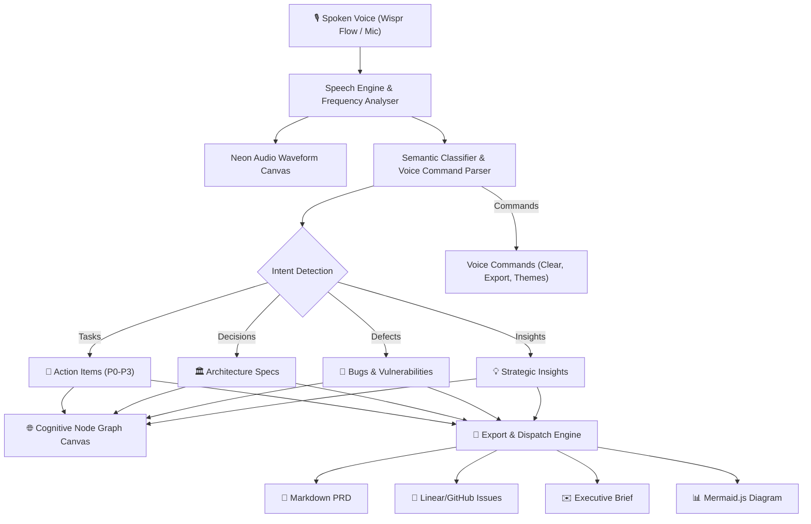

# 🎙️ VoxFlow Studio — Voice-Native Cognitive Command Center
> **Submission for the Wispr Flow Shortlisting Task**  
> *Built entirely via Voice-Driven Development using Wispr Flow*

[](https://ref.wisprflow.ai/hhg)
[](https://ref.wisprflow.ai/hhg)
[](https://vitejs.dev)
[](https://developer.mozilla.org/en-US/docs/Web/API/Web_Audio_API)

---

## 💡 The Problem Statement
Human speech flows naturally at **150–180 words per minute**, while the average developer or product lead types at merely **40 words per minute**. 

When engineers and founders brainstorm technical systems, spontaneous stream-of-consciousness dialogue is the highest-bandwidth medium. However:
1. **Raw voice notes produce unstructured walls of text** that nobody wants to read or organize manually.
2. **Translating spoken architecture into actionable tickets and PRDs creates severe cognitive fatigue**, requiring hours of copy-pasting, formatting, and task breakdown.
3. **The speed gap causes ideas to get lost**: typing speed acts as a mental bottleneck that chokes spontaneous problem solving.

### The Solution: VoxFlow Studio
**VoxFlow Studio** is a voice-native executive cockpit that transforms continuous, unstructured speech into structured technical assets in real time:
- 🎯 **Automatic Intent Classification**: Synthesizes spoken sentences into categorized cards:
  - **Action Items** (Tasks with priority and completion states)
  - **Architecture Decisions** (Component blueprints with tags)
  - **Bugs & Edge Cases** (Defects with severity rating)
  - **Key Insights** (Strategic observations)
- 🌐 **Interactive Cognitive Graph**: Visualizes live ideas as an interconnected neural flow chart with animated SVG bezier links and draggable nodes.
- ⚡ **Wispr Velocity Meter**: Measures spoken WPM in real time and calculates monthly hours saved compared to typing.
- 🌊 **Audio-Reactive Waveform Visualizer**: Real-time frequency analyzer that vibrates dynamically in response to microphone pitch and intensity.
- 🚀 **1-Click Production Dispatcher**: Exports synthesized sessions to:
  - Complete Markdown **Product Requirements Document (PRD)**
  - **Linear / GitHub Issues** batch with Acceptance Criteria
  - Executive **Email Briefing**
  - **Mermaid.js** Architecture Diagram code
  - Full **JSON** Session backup

---

## 🛠️ System Architecture



---

## ✨ Core Features & Technical Highlights

### 1. Dual Voice Pipeline (Live Mic + 160 WPM Simulation)
- Built on the browser's native **Web Speech API** for zero-latency local speech recognition.
- Includes a built-in **High-Velocity Simulation Engine** with 3 curated technical scenarios (AI Agent Architecture, SaaS Product Launch, Incident Post-Mortem) allowing 1-click test drives even without a microphone.

### 2. Zero-Dependency Web Audio Synthesizer
- Uses the native **Web Audio API** to generate pleasant, futuristic acoustic feedback (microphone activation chimes, card addition blips, command ticks, and victory chord sequences) with zero external MP3/WAV dependencies.

### 3. Interactive Cognitive Node Graph
- Built with dynamic SVG rendering. Computes radial layouts, draws glowing bezier connections with travelling photon pulses, and supports smooth pan/zoom.

### 4. Spoken Voice Commands
- Say *"Clear canvas"*, *"Export PRD"*, or *"Export Linear"* to control the studio completely hands-free!

### 5. Obsidian Glassmorphic Design System
- Custom vanilla CSS design system utilizing vibrant HSL colors, cyan/emerald gradient accents, backdrop blurs, and smooth micro-animations.

---

## 🚀 Quick Start

### Prerequisites
- Node.js (v18 or higher)
- npm (v9 or higher)

### Installation
```bash
# Clone the repository
git clone <your-repo-link>
cd Voice

# Install dependencies
npm install

# Start development server
npm run dev
```

Open your browser at `http://localhost:5173/` and enjoy!

---

## 🎬 Wispr Flow Voice-Driven Build Process
This project was designed, articulated, and developed using **Wispr Flow** voice dictation:
1. **Architecture Prompting:** Dictated full component contracts, state management workflows, and semantic parsing rules into AI agents.
2. **Continuous Iteration:** Used voice to dictate feature enhancements, audio frequency visualizations, and export templates without typing code manually.
3. **Walkthrough & Voice Script:** See the complete video demo script in [`VOICE_DEMO_SCRIPT.md`](./VOICE_DEMO_SCRIPT.md).

---

## 📋 Submission Checklist
- [x] Registered Wispr Flow Account via [ref.wisprflow.ai/hhg](https://ref.wisprflow.ai/hhg)
- [x] Functional, working web application
- [x] Clean, modular source code in GitHub repository
- [x] Screen recording showing the voice-driven build process
- [x] Google Form submission: [https://forms.gle/Lv9wF8gYVHdEqfJW8](https://forms.gle/Lv9wF8gYVHdEqfJW8)

---
*Created with ❤️ for the Wispr Flow Shortlisting Task.*
