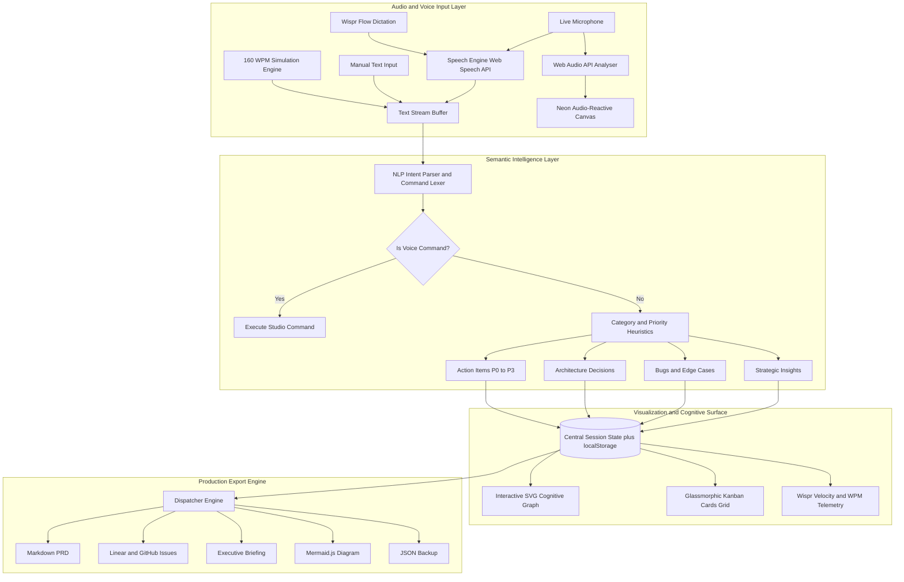

<div align="center">

<br/>


<br/>

### *Transform stream-of-consciousness speech into structured PRDs, Linear tickets, and neural architecture maps — **in real time.***

<br/>

[](https://ref.wisprflow.ai/hhg)
[](https://ref.wisprflow.ai/hhg)
[](https://react.dev/)
[](https://vitejs.dev/)
[](https://developer.mozilla.org/en-US/docs/Web/API/Web_Audio_API)
[](LICENSE)

<br/>

[Features](#-core-features) &nbsp;•&nbsp; [Velocity Gap](#-the-4x-velocity-gap) &nbsp;•&nbsp; [Architecture](#-system-architecture) &nbsp;•&nbsp; [Voice Commands](#-voice-commands) &nbsp;•&nbsp; [Quick Start](#-quick-start)

<br/>

> **Official Submission for the Wispr Flow Shortlisting Task**
> Conceptualized, planned, and coded end-to-end via Voice-Driven Development using [Wispr Flow](https://ref.wisprflow.ai/hhg)

---

</div>

## What is VoxFlow Studio?

Human thought travels at conversational speed (**150-180 words per minute**), but traditional development tools trap engineers behind a keyboard bottleneck of **~40 words per minute**.

**VoxFlow Studio** eliminates this gap. It provides a real-time, voice-first canvas that listens to your unstructured brainstorming, extracts intent using on-the-fly semantic parsing, projects your thoughts into an interactive neural graph, and dispatches production-ready artifacts — all in one unified cockpit.

```
       Voice Stream via Wispr Flow (160+ WPM)
                         |
                         v
           [ Web Audio & Speech Engine ]
                         |
          +--------------+--------------+
          v                             v
 [ Audio Waveform Canvas ]    [ Real-Time NLP Classifier ]
                                        |
       +--------------+-----------------+--------------+
       v              v                 v              v
  Action Items   Architecture       Bug / Risk      Insight
  (P0-P3)        Decisions          Defects         Notes
       +--------------+-----------------+--------------+
                      v
         [ Dynamic Cognitive Node Graph ]
                      |
                      v
   [ 1-Click Production Export Engine ]
    |-- Markdown Product Requirements Document (PRD)
    |-- Linear / GitHub Issues with Acceptance Criteria
    |-- Executive Briefing Email
    `-- Mermaid.js Live Architecture Diagram
```

---

## The 4x Velocity Gap

| Metric | Traditional Keyboard | VoxFlow Studio + Wispr Flow |
|:---|:---|:---|
| **Input Speed** | ~40 WPM average | **160+ WPM** natural speech |
| **Cognitive Load** | Context switching between code/docs/issues | **Zero switching** — talk while ideating |
| **Idea Capture** | Fleeting thoughts are lost | **100% captured & auto-categorized** |
| **PRD Generation** | 45-60 min manual formatting | **Instant 1-click export** |
| **Ticket Creation** | Manual copy-paste into Jira/Linear | **Batch auto-generated** with priorities |
| **Audio Feedback** | Silent / keyboard clatter | **Interactive chimes & Web Audio synthesis** |

---

## Core Features

### 1. Dual Speech Engine — Live Mic + 160 WPM Simulator

- **Native Web Speech Recognition**: Sub-millisecond voice transcription with no cloud API latency
- **Manual Text Input**: Type to simulate voice when testing or demoing without a microphone
- **Curated Simulation Scenarios** — one-click preset sessions:
  - Autonomous AI Agent Architecture
  - High-Scale SaaS Launch Roadmap
  - Production Incident Post-Mortem

### 2. Real-Time Semantic Intent Classifier

Automatically tags and categorizes free-form sentences into distinct operational containers:

| Category | Icon | Triggered By | Default Priority |
|:---|:---|:---|:---|
| **Action Items** | Target | `implement`, `build`, `todo`, `deploy`, `assign` | P2 |
| **Architecture Decisions** | Building | `architecture`, `database`, `microservice`, `protocol` | P1 |
| **Bugs & Edge Cases** | Bug | `bug`, `crash`, `leak`, `timeout`, `regression` | P1 |
| **Strategic Insights** | Lightbulb | `insight`, `metric shows`, `user research`, `takeaway` | P3 |

Priority auto-escalates on detection of `P0`, `critical`, `blocker`, `urgent`.

### 3. Interactive Cognitive Node Graph

- **Dynamic SVG neural canvas** — renders ideas as interconnected glowing nodes
- Computed **radial layout** with cubic bezier curve connections
- **Animated photon pulse particles** traveling along connections in real time
- Click-to-select a node to highlight the linked card on the right panel
- Pan, zoom, auto-fit view controls

### 4. Audio-Reactive Frequency Waveform

- High-performance HTML5 Canvas powered by **Web Audio API AnalyserNode**
- Neon cyan/emerald FFT bars that pulse dynamically with microphone pitch and amplitude
- Smooth 60fps animation loop even during active speech processing

### 5. Wispr Velocity Meter & ROI Calculator

- Real-time **Words-Per-Minute (WPM)** telemetry during live sessions
- Live calculation of **Monthly Hours Saved** vs. 40 WPM typing baseline
- Session statistics: cards created, tasks assigned, and total cognitive velocity

### 6. 1-Click Production Dispatcher

Export your entire brainstormed session immediately:

| Format | Description |
|:---|:---|
| **Markdown PRD** | Structured doc with objectives, architecture, action plans |
| **Linear / GitHub Issues** | Formatted ticket batches with acceptance criteria checkboxes |
| **Executive Email Brief** | Concise stakeholder update formatted for instant sending |
| **Mermaid.js Diagram** | Code-ready architecture diagram for direct GitHub paste |
| **JSON Backup** | Complete session export for portability |

### 7. Zero-Dependency Acoustic Synthesizer

- Built directly on the **Web Audio API** — no external sound files
- Pleasant procedural soundscapes: Mic chime, card creation blip, voice command confirmation, victory chord

### 8. Persistent Session State

- All captured items auto-saved to **localStorage** — reload and resume any session
- Per-card status management: `todo` -> `active` -> `done` with one click
- Individual card deletion or full canvas clear

---

## System Architecture



---

## Voice Commands

Control VoxFlow Studio completely hands-free while dictating:

| Voice Phrase | Action | Audio Feedback |
|:---|:---|:---|
| `"Clear canvas"` / `"Reset board"` | Clears all cards and graph nodes | Soft descending tone |
| `"Export PRD"` / `"Download PRD"` | Opens Export Hub | Harmonic success chime |
| `"Export Linear"` / `"Export tickets"` | Opens Export Hub with issues tab | Double confirmation blip |
| `"Switch mode"` / `"Toggle theme"` | Toggles UI theme state | High-pitch tick |

---

## Tech Stack

| Layer | Technology |
|:---|:---|
| **Frontend Framework** | [React 19](https://react.dev/) + [Vite 8](https://vitejs.dev/) |
| **Audio Engine** | Web Audio API (`AudioContext`, `AnalyserNode`, `OscillatorNode`) |
| **Speech Processing** | Web Speech API + Custom Rule-Based NLP Parser |
| **Styling** | Pure Vanilla CSS — Obsidian glassmorphism, HSL variables, neon palette |
| **Icons** | [Lucide React](https://lucide.dev/) |
| **Micro-animations** | CSS keyframes + Canvas 60fps loops |
| **Persistence** | Browser `localStorage` — zero backend required |
| **Build Tool** | Vite 8 with React plugin |
| **Linting** | [OxLint](https://oxc.rs/docs/guide/usage/linter.html) (Rust-based, ultra-fast) |
| **Confetti** | [Canvas Confetti](https://www.npmjs.com/package/canvas-confetti) |

**Design System color tokens:**
- Primary neon: `#06b6d4` (cyan)
- Secondary: `#10b981` (emerald)
- Accent: `#8b5cf6` (violet)
- Background: Obsidian `#0a0e1a` with glassmorphic `backdrop-filter: blur(16px)`

---

## Quick Start

### Prerequisites

- **Node.js**: v18.0.0 or higher
- **npm**: v9.0.0 or higher
- Modern browser with Web Speech API support (**Chrome**, **Edge**, or **Brave** recommended)

### Installation

```bash
# 1. Clone the repository
git clone https://github.com/Monish03905/Task-Wispr-Flow.git
cd Task-Wispr-Flow

# 2. Install dependencies
npm install

# 3. Start the local development server
npm run dev
```

Navigate to `http://localhost:5173` in your browser.

### Optional Commands

```bash
# Lint the codebase
npm run lint

# Build for production
npm run build

# Preview the production build
npm run preview
```

---

## Project Structure

```
Task-Wispr-Flow/
|-- public/                       # Static assets
|-- src/
|   |-- components/
|   |   |-- Navbar.jsx            # Top navigation, metrics, scenario selector
|   |   |-- WaveformVisualizer.jsx# Audio-reactive FFT canvas
|   |   |-- LiveDictationBar.jsx  # Dictation cockpit + voice command strip
|   |   |-- ConceptGraphCanvas.jsx# Interactive SVG cognitive node graph
|   |   |-- StructuredCardsGrid.jsx# Categorized Kanban cards
|   |   |-- WisprComparisonWidget.jsx # Velocity meter & ROI calculator
|   |   |-- ExportModal.jsx       # 5-format production dispatcher
|   |   |-- VoiceScriptGuideModal.jsx # Build guide modal
|   |   `-- WisprAccountModal.jsx # Account / Wispr integration panel
|   |-- utils/
|   |   |-- speechEngine.js       # Web Speech API + 160 WPM simulation engine
|   |   |-- nlpParser.js          # Real-time semantic classifier & NLP
|   |   |-- audioSynthesizer.js   # Web Audio API procedural sound effects
|   |   `-- exportFormats.js      # PRD, tickets, email, Mermaid generators
|   |-- App.jsx                   # Root component + state orchestration
|   |-- index.css                 # Full design system (~35KB pure CSS)
|   `-- main.jsx                  # React 19 entry point
|-- index.html
|-- package.json
|-- vite.config.js
`-- README.md
```

---

## Demo Walkthrough

This application was conceptualized, planned, and programmed using voice-driven development with [Wispr Flow](https://ref.wisprflow.ai/hhg).

- **Demo Script**: Full scene-by-scene recording script in [VOICE_DEMO_SCRIPT.md](./VOICE_DEMO_SCRIPT.md)
- **Duration**: ~2 min 30 sec showing live dictation, waveform reactivity, and real-time artifact generation

**Try it live in 30 seconds:**
1. Open the app and click **Try Preset Scenario...**
2. Select **SaaS Launch Roadmap**
3. Watch the cognitive graph build in real time
4. Click **Export Hub** and copy your instant Markdown PRD

---

## Task Submission Checklist

- [x] **Wispr Flow Account**: Created and authenticated via [ref.wisprflow.ai/hhg](https://ref.wisprflow.ai/hhg)
- [x] **Working Web Application**: Fully interactive voice-native command center with reactive audio
- [x] **Modular Architecture**: Clean React 19 component structure with decoupled audio, speech, and NLP utilities
- [x] **Obsidian Glassmorphism UI**: High-end modern developer cockpit aesthetics
- [x] **Zero External Asset Dependencies**: Self-synthesized Web Audio sound effects and SVG graph physics
- [x] **Session Persistence**: localStorage auto-save — resume any session on reload
- [x] **5-Format Export Engine**: PRD, GitHub Issues, Email, Mermaid, JSON
- [x] **Preset Demo Scenarios**: 3 curated simulation scripts for instant demo
- [x] **Voice Command System**: Hands-free canvas control while dictating
- [x] **Official Submission Form**: Ready for [Google Form submission](https://forms.gle/Lv9wF8gYVHdEqfJW8)

---

## Contributing

Contributions are welcome!

1. Fork the repository
2. Create a feature branch: `git checkout -b feature/AmazingFeature`
3. Commit your changes: `git commit -m 'Add AmazingFeature'`
4. Push to the branch: `git push origin feature/AmazingFeature`
5. Open a Pull Request

---

## License

Distributed under the **MIT License**. See `LICENSE` for details.

---

<div align="center">

Crafted with voice and care for the **Wispr Flow Shortlisting Task**

[](https://ref.wisprflow.ai/hhg)
&nbsp;&nbsp;•&nbsp;&nbsp;
[Report Issue](https://github.com/Monish03905/Task-Wispr-Flow/issues)
&nbsp;&nbsp;•&nbsp;&nbsp;
[Request Feature](https://github.com/Monish03905/Task-Wispr-Flow/pulls)

*Built with React 19 · Vite 8 · Web Audio API · Web Speech API*

</div>
